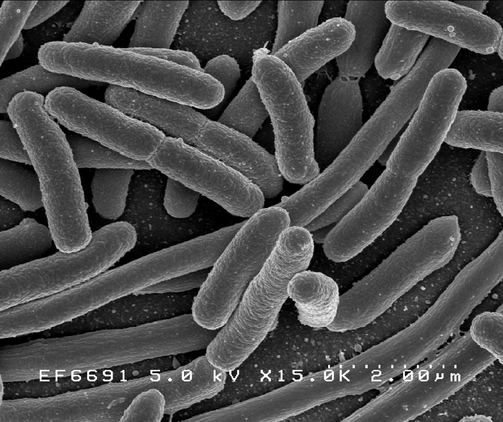

```{r setup, include = FALSE}
knitr::opts_chunk$set(echo = FALSE)

library(here)
library(plotly)
library(ggplot2)
library(magrittr)
library(htmlwidgets)
library(DT)

setwd(here())
```


# Slide with default settings

This slide has content in the default layout.

There should be two pictures of equal size below, one pulled to the right and one pulled to the left.

.pull-left[
```{r, echo = FALSE, out.width = "300px", fig.align = "center", dpi = 100, fig.cap = "Image courtesy of NIH NIAID"}



```
]

.pull-right[
```{r, echo = FALSE, out.width = "300px", fig.align = "center", dpi = 100, fig.cap = "Image courtesy of NIH NIAID"}


```
]

---
# Slide with default settings

This slide has content in the default layout.

.larger[This text should be a bit larger,] .smaller[and this text should be a bit smaller.]

.pull-left[
```{r, echo = FALSE, out.width = "300px", fig.align = "center", dpi = 100, fig.cap = "Image courtesy of NIH NIAID"}


```
]

.pull-right[
```{r, echo = FALSE, out.width = "300px", fig.align = "center", dpi = 100, fig.cap = "Image courtesy of NIH NIAID"}


```
]

---
class: center, middle

# Slide with content in center-middle

This slide has content in the middle. Wonderful.

You could use this to make a kind of intertitle. Does it still look good with the title in the middle? I don't know!

---
# Big picture test
<div style="padding-top: 25px"></div>
```{r, echo = FALSE, out.width = "65%", fig.align = "center", dpi = 100, fig.cap = "Image courtesy of NIH NIAID"}


```

---
# Test slide 1, quadrants

.top-left-img[
```{r, echo = FALSE, out.width = "300px", fig.align = "center", dpi = 100, fig.cap = "Image courtesy of NIH NIAID"}


```
]

.top-right-text[

This a test of the the classes which define text and image quadrants for all four corners of the slide. If text overflows a box it should be hidden, which I will demonstrate by typing an excessively long sentence which doesn't go anywhere but shows you what happens if the text overflows the box.

]

.bottom-left-text[

<div style="padding-top: 25px"></div>

Text is unfortunately not vertically centered by default. This can be fixed using a div tag like `<div style="padding-top: 25px"></div>` to add some padding.

]

.bottom-right-img[
```{r, echo = FALSE, out.width = "250px", fig.align = "center", dpi = 100, fig.cap = "Image courtesy of NIH NIAID"}

```
]

---
# Test slide 1c, text quadrants

.top-left-text[

Lorem ipsum dolor sit amet.

]

.top-right-text[

Lorem ipsum dolor sit amet, consectetur adipiscing elit, sed do eiusmod tempor incididunt ut labore et dolore magna aliqua. Ut enim ad minim veniam, quis nostrud exercitation ullamco laboris nisi ut aliquip ex ea commodo consequat.

]

.bottom-left-text[

Lorem ipsum dolor sit amet, consectetur adipiscing elit, sed do eiusmod tempor incididunt ut labore et dolore magna aliqua. Ut enim ad minim veniam, quis nostrud exercitation ullamco laboris nisi ut aliquip ex ea commodo consequat. Lorem ipsum dolor sit amet.

]

.bottom-right-text[

Lorem ipsum dolor sit amet, consectetur adipiscing elit, sed do eiusmod tempor incididunt ut labore et dolore magna aliqua. Ut enim ad minim veniam, quis nostrud exercitation ullamco laboris nisi ut aliquip ex ea commodo consequat. Lorem ipsum dolor sit amet.

]

---
# Test slide 1d, img quadrants

.top-left-img[

```{r, echo = FALSE, out.width = "300px", fig.align = "center", dpi = 100, fig.cap = "Image courtesy of NIH NIAID"}

```

]

.top-right-img[

```{r, echo = FALSE, out.width = "300px", fig.align = "center", dpi = 100, fig.cap = "Image courtesy of NIH NIAID"}

```

]

.bottom-left-img[

```{r, echo = FALSE, out.width = "300px", fig.align = "center", dpi = 100, fig.cap = "Image courtesy of NIH NIAID"}

```

]

.bottom-right-img[

```{r, echo = FALSE, out.width = "300px", fig.align = "center", dpi = 100, fig.cap = "Image courtesy of NIH NIAID"}

```

]

---
 
# Test slide 2, two quads and right column

.top-left-img[
```{r, echo = FALSE, out.width = "300px", fig.align = "center", dpi = 100, fig.cap = "Image courtesy of NIH NIAID"}

```
]

.bottom-left-img[
```{r, echo = FALSE, out.width = "300px", fig.align = "center", dpi = 100, fig.cap = "Image courtesy of NIH NIAID"}

```
]

.column2-right[

<br><br>
Lorem ipsum dolor sit amet, consectetur adipiscing elit, sed do eiusmod tempor incididunt ut labore et dolore magna aliqua. Ut enim ad minim veniam, quis nostrud exercitation ullamco laboris nisi ut aliquip ex ea commodo consequat.

]

---

# Test slide 3, two columns

.column2-left[
```{r, echo = FALSE, out.width = "100%", fig.align = "center", dpi = 100, fig.cap = "Image courtesy of NIH NIAID"}

```

Lorem ipsum dolor sit amet, consectetur adipiscing elit.
]

.column2-right[
Lorem ipsum dolor sit amet, consectetur adipiscing elit.

```{r, echo = FALSE, out.width = "100%", fig.align = "center", dpi = 100, fig.cap = "Image courtesy of NIH NIAID"}

```
]

---

# Test slide 4, three columns

.column3-left[

Lorem ipsum dolor sit amet, consectetur adipiscing elit, sed do eiusmod tempor incididunt ut labore et dolore magna aliqua.

]

.column3-center[

```{r, echo = FALSE, out.width = "700px", fig.align = "center", dpi = 100, fig.cap = "Image courtesy of NIH NIAID"}

```

]

.column3-right[

Lorem ipsum dolor sit amet, consectetur adipiscing elit, sed do eiusmod tempor incididunt ut labore et dolore magna aliqua.

]

---

# Test slide 5, big left column, small right

.column2-left-big[

```{r, echo = FALSE, out.width = "600px", fig.align = "center", dpi = 100, fig.cap = "Image courtesy of NIH NIAID"}

```

]

.column2-right-small[

Lorem ipsum dolor sit amet, consectetur adipiscing elit, sed do eiusmod tempor incididunt ut labore et dolore magna aliqua. Lorem ipsum dolor sit amet.

]

---
#ggplot test slide

.smaller[You can use a boring, static ggplot..]

```{r, out.width = "75%", dpi = 150, fig.align = "center", fig.asp = 0.6}

ggplot(mtcars) +
  geom_point(mapping = aes(mpg, hp))

```

---
#Plotly test slide

.smaller[Or you can use a dynamic, exciting *ggplotly*!]

```{r, fig.align = "center"}

gg <- ggplot(mtcars) +
  geom_point(mapping = aes(mpg, hp))

ggplotly(p = gg, width = 700, height = 500)

```

---
#Plotly test slide 2

.column2-left[
```{r, out.width = "250px"}

gg <- ggplot(mtcars) +
  geom_point(mapping = aes(mpg, hp))

ggplotly(p = gg)

```
]

.column2-right[
```{r, out.width = "250px"}

gg <- ggplot(mtcars) +
  geom_point(mapping = aes(mpg, hp))

ggplotly(p = gg)

```
]

---
.smaller[Can I use a DT effectively? They're a bit buggy..]

```{r}
DT::datatable(iris, style = "bootstrap",
              class = 'table-condensed table-hover table-striped row-border',
              fillContainer = F, options = list(pageLength = 8, initComplete = JS(
                "function(settings, json) {",
                "$(this.api().table().container()).css({'font-size': '65%'});",
                "}")
              )
)
```

---
.smaller[Perhaps a Kable works better?]

```{r}
knitr::kable(head(iris), "html") %>% kableExtra::kable_styling(font_size = 9)
```

